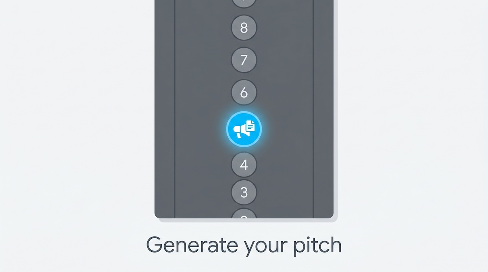
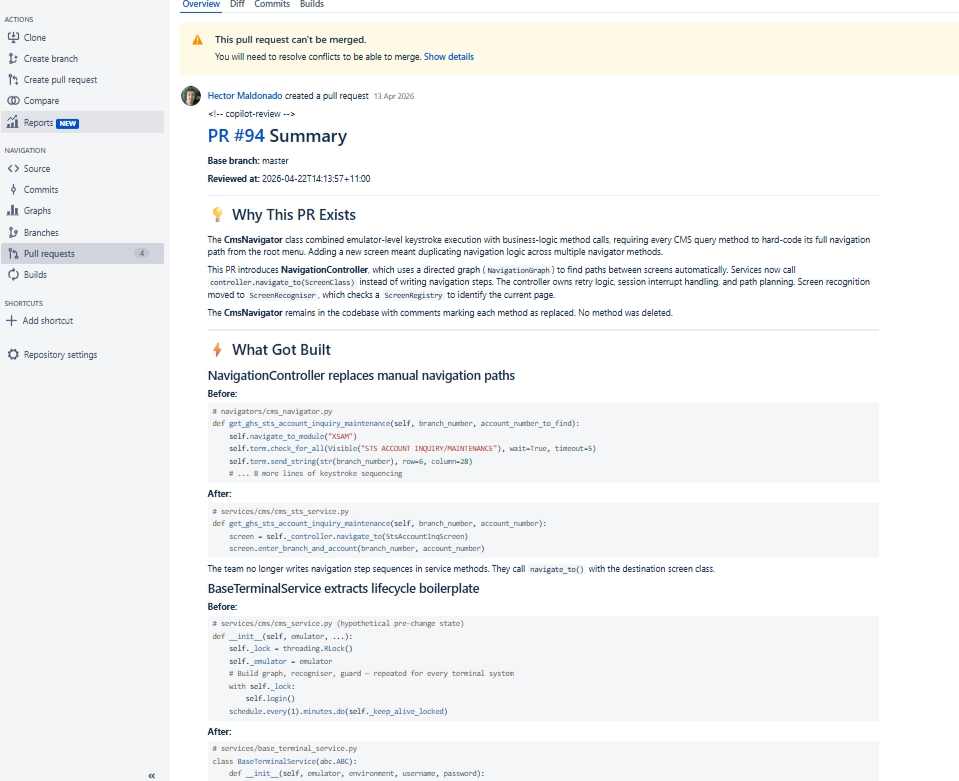
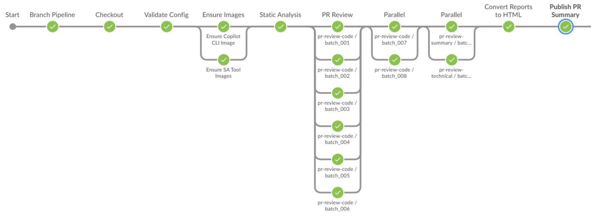
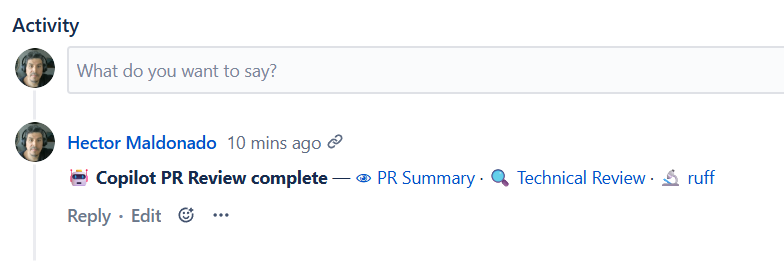

# Majordomo — repository operations for evolving software.



This pipeline plugs GitHub Copilot CLI into Jenkins to run a consistent, skill-based review on every qualifying PR. It classifies changed files by type, routes each group to the matching review skill (security and logic for source code, prose quality for documentation), and archives structured markdown reports as Jenkins build artifacts.

---

🎉🎊✨ **[The portable pipeline pattern](docs/01-portable-pipeline-pattern.md).** Use `01-portable-pipeline-pattern.md` for the generic pattern and architecture, and [setup](docs/02-setup.md) for this repository's concrete implementation details.

---

[](docs/07-example-summary.md)


## 💡 Why This Exists

**Code review is a bottleneck.** Reviewers see too much at once, miss security issues under time pressure, and have no systematic way to ask "what else does this change break?"

This pipeline treats a PR review as a structured process. Each file is reviewed in priority order: security first, input handling next, logic correctness and test coverage last. After all files are reviewed, a separate pass maps blast-radius across the whole changeset. Reports convert to JUnit XML (a test-result format Jenkins reads natively), so the CI signal reflects the review result without requiring anyone to check another system.

**Requirements:** A Jenkins project, a Bitbucket webhook, and an enterprise Copilot token.

---

## 🚀 Setup

Three steps: add the submodule, run setup for your job model, add a Bitbucket webhook.

```text
Per-repo setup (setup-majordomo.py)
  App repo (pipeline branch)
    ├── .majordomo/                ← submodule (this repo)
    └── .majordomo-config.groovy  ← credentials and registry config

                 ▼  setup-majordomo.py

  Jenkins job (Pipeline from SCM)
    SCM    → your app repo, pipeline branch
    Script → .majordomo/pipelines/MajordomoReview.CI.Jenkinsfile

Central setup (setup-majordomo-central.py)
  This repo (pipelines branch)
    └── majordomo-central-config/  ← org-wide defaults and per-repo configs

                 ▼  setup-majordomo-central.py

  Jenkins job (Pipeline from SCM)
    SCM    → this repo, pipelines branch
    Script → .majordomo/pipelines/MajordomoReview.Central.CI.Jenkinsfile

               ▼  Bitbucket PR webhook  (pr:opened, pr:from_ref_updated)

PR review runs on every qualifying PR event
```

Use `setup-majordomo.py` for per-repo jobs, or `setup-majordomo-central.py` for a shared central job.

`setup-majordomo.py` validates config, verifies all credentials exist in Jenkins, then creates or updates the standard per-repo job:

```bash
# Create
python .majordomo/scripts/setup-majordomo.py \
    --api-token <jenkins-api-token> \
    --job-name  <job-name> \
    --folder    <jenkins-folder> \
    --create-job

# Update (picks job interactively if --job-name is omitted; skips when nothing changed)
python .majordomo/scripts/setup-majordomo.py \
    --api-token <jenkins-api-token> \
    --update-job
```

`setup-majordomo-central.py` validates `majordomo-central-config/`, verifies credentials, and creates or updates the central dispatcher-style job:

```bash
# Create central job
python .majordomo/scripts/setup-majordomo-central.py \
    --api-token <jenkins-api-token> \
    --folder <jenkins-folder> \
    --repo-url ssh://git@bitbucket.example.com/example-project/majordomo.git \
    --create-job
```

Full instructions: [02 — Setup](docs/02-setup.md) (see Standard Pipeline Setup and Central Pipeline Setup).

---

## 🔍 How It Works

A Bitbucket webhook fires on `pr:opened` and `pr:from_ref_updated` events. The Generic Webhook Trigger plugin (a Jenkins plugin that receives POST webhooks and maps JSON fields to build parameters) extracts the PR number, source branch, and target branch and passes them to the Jenkins job. The pipeline ensures the Copilot CLI Docker image exists, runs the PR review inside it, and archives markdown reports as build artifacts.

Duplicate webhook deliveries for the same commit are skipped by Pipeline Guard. New commits on an open PR (`pr:from_ref_updated`) trigger a new review run.

---

## ⚙️ How the Review Runs

The pipeline has nine core stages, all wrapped by a `Pipeline Guard` stage that deduplicates webhook events and enforces per-branch concurrency control:

1. **Safe Checkout** — Prepare workspace, fix root-owned file permissions
2. **Pipeline Snapshot Guard** — Detect submodule drift; prompt for fresh build if needed
3. **Validate Config** — Ensure `.majordomo-config.groovy` is present
4. **Ensure Images** — Build/push Copilot CLI image; optionally build SA tool images
5. **Notify: Build In Progress** — Post INPROGRESS status to Bitbucket (if configured)
6. **Static Analysis** — Run configured SA tools (ruff, eslint, etc.) against changed files
7. **PR Review** — Main work: classify files, run Copilot agents in parallel, aggregate findings
8. **Convert Reports to HTML** — Generate self-contained `.html` artifacts from markdown reports
9. **Publish PR Summary** — Post summary.md to Bitbucket PR

The `Pipeline Guard` wrapper detects duplicate webhook events (both `repo:refs_changed` and `pr:from_ref_updated` fire for the same commit) and skips inner stages, preventing wasted executor time.



The final stage posts `summary.md` as a comment on the Bitbucket PR:



---

## 🏷️ Customising the Review

The pipeline routes changed files automatically. No routing config is needed for most projects.

**File-review skills** (routed by file type, produce per-file reports):

| Skill | Default routing | Blast radius |
|---|---|---|
| `pr-review-code` | Source code (Python, JS, Java, Go, and 20+ more extensions) | Yes (mandatory) |
| `pr-review-docs` | `**/*.md`, `**/*.rst` | No |
| `pr-review-conf` | `**/*.yml`, `**/*.yaml`, `**/*.toml`, `**/*.json`, `**/*.ini`, and more | No |
| `pr-review-tests` | Not routed by default — add explicit routing to include test files | No |

**Synthesis skills** (run automatically after file-review, not routed by file type):

| Skill | What it produces |
|---|---|
| `pr-review-summary` | `summary.md` — high-level PR summary written for developer and reviewer |
| `pr-review-technical` | `tech-review.md` — deep-dive: control flow, concurrency, test coverage gaps |
| `pr-review-blast-radius` | `blast-radius.md` — impact map across the changeset |

**Scoring skills** (used internally by iteration loops, not invoked directly):

| Skill | What it does |
|---|---|
| `pr-review-summary-score` | Scores `summary.md` against a rubric; drives the write/score iteration loop |
| `pr-review-technical-score` | Scores `tech-review.md` against a rubric; drives the tech-review iteration loop |

`git-diff-prep.py` classifies each changed file using glob patterns. The first matching pattern wins. A PR with files in multiple skills invokes the orchestrator once per skill.

All customisation goes in the `pipelines` block of `.majordomo-config.groovy`. Omit any key to keep the submodule default.

### Inject team or domain context into the reviewer

Inject team-specific facts, tech stack, and custom rules into every review prompt for a repo — or scope them per path for monorepos. First matching glob wins for scoped context:

```groovy
pipelines: [
    'pr-review': [
        agentContext: [
            global: [
                customRules: ['No hardcoded credentials.'],
            ],
            scoped: [
                'services/payments-api/**': [
                    techStack:   ['python', 'fastapi', 'openapi'],
                    reviewFocus: ['openapi-contract', 'auth'],
                    customRules: [
                        [file: '.majordomo/rules/mesh-api-contract.md'],  // loaded from disk
                        'FastAPI must use exception_handlers, not Flask-style decorators.',
                    ],
                ],
            ],
        ],
    ],
],
```

See [Inject team context](docs/advanced/09-customising-the-review.md#inject-team-or-domain-context-into-the-reviewer) for the full reference.

### Override which files each skill receives

First matching glob wins:

```groovy
pipelines: [
    'pr-review': [
        routing: [
            'pr-review-docs': ['**/*.md', '**/*.rst', 'docs/**', '**/*.yml', '**/*.yaml', '**/*.toml', '**/*.json'],
            'pr-review-code': ['**'],  // catch-all — must be last
        ],
    ],
],
```

### Override a skill's review rules

Point to your own skill directory (must contain a `SKILL.md`):

```groovy
pipelines: [
    'pr-review': [
        skills: [
            'pr-review-docs': 'agents/skills/my-docs',  // path relative to your app repo root
            'pr-review-code': null,                      // null = use submodule default
        ],
    ],
],
```

### Override the orchestrator agent

Replace the shared review protocol itself:

```groovy
pipelines: [
    'pr-review': [
        agent: 'agents/my-pr-review.agent.md',  // path relative to your app repo root
    ],
],
```

**Add a new pipeline** (e.g. automated testing) by adding an entry under `pipelines` with its own orchestrator, skills, and routing. Create the corresponding `SKILL.md` files in your app repo and the dispatcher will pick them up automatically. No changes to the submodule required.

The exclusion filters for which files are sent to any skill are in `scripts/git-diff-prep.py` under `EXCLUDE_PATTERNS`. Add patterns there to skip generated files, lock files, or other paths that don't need review.


## 📚 Docs

**Roadmap:**
- [PLAN — Control Tower, GitHub Actions, and Go](docs/PLAN-control-tower-github-go.md): target architecture for SCM-agnostic reviews on GitHub minutes

**Go CLI (in progress):**
```bash
go build -o majordomo ./cmd/majordomo
./majordomo version
./majordomo prep <base-branch> <staging-dir> \
  [--routing path] [--agent-context path] [--summary-config path]
```

`majordomo prep` is the Go port of `pipelines/scripts/git-diff-prep.py` (same staging layout and exit codes `0` / `1` / `2`). Jenkins prefers the binary when present; set `MAJORDOMO_PREP=python` to force the Python script.

```bash
./majordomo poll   # stub — Phase 1
```

**Start here:**
- [01 — Portable Pipeline Pattern](docs/01-portable-pipeline-pattern.md): why the pattern exists and how it works
- [02 — Setup](docs/02-setup.md): add the submodule, configure Jenkins, wire up the Bitbucket webhook
- [03 — Manage Submodule](docs/03-manage-submodule.md): update, switch branches, pin to a commit

**Understanding the pipeline:**
- [04 — Pipeline Stages](docs/04-pipeline-stages.md): four-stage overview: staging → review → convert → publish
- [05 — File Orchestration and Batching](docs/05-file-orchestration.md): how diffs become dependency-aware batches and skills run in parallel
- [06 — PR Summary Flow](docs/06-pr-summary-flow.md): how the generate/score loop works for summaries

**Reference:**
- [07 — Example Summary](docs/07-example-summary.md): sample output from a real PR