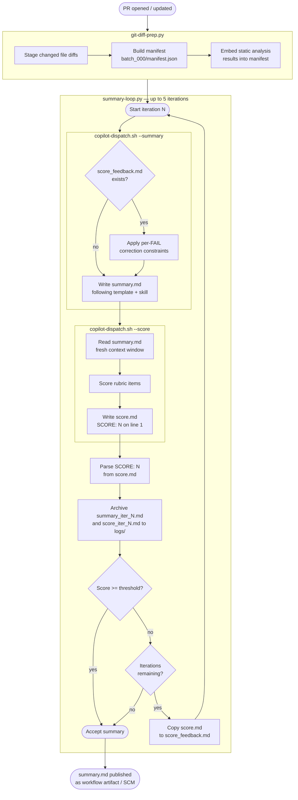

# PR Summary Flow: How the Generate/Score Loop Works

*Majordomo — repository operations for evolving software.*

This guide is for engineers running or tuning the PR summary pipeline. It explains the generate/score loop, what each pass does, and how to configure thresholds and iteration limits.

The loop repeats until the summary meets a quality threshold or the
attempt cap is reached. The final `summary.md` is uploaded as a workflow artifact (or published to the SCM) alongside the detailed per-file findings.

## 🧭 What You'll Learn

**Overview:**
- [What the Flow Produces](#what-the-flow-produces) - Shape and purpose of the generated summary
- [How the Loop Works](#how-the-loop-works) - Write, score, and feedback cycle explained

**Internals:**
- [Flow Diagram](#flow-diagram) - Full generate/score loop as a Mermaid diagram
- [Components](#components) - The six files that make up the flow and their roles

**Reference:**
- [Tuning the Loop](#tuning-the-loop) - Environment variables that control iterations and pass threshold
- [How Feedback Reaches the Writer](#how-feedback-reaches-the-writer) - How score failures feed back into the next iteration

---

## 💡 What the Flow Produces

A single `summary.md` written for two readers: the developer who wants to explain their PR,
and the reviewer who needs to understand it before reading per-file findings. It is not a
changelog or a diff summary. It answers: what was broken before, what was built to fix it,
what is low-risk to approve, and where a human judgment call is needed.

---

## ⚡ How the Loop Works

Each iteration has two AI invocations. The first writes the summary using the diff, manifest
metadata (the file list and routing information produced by `git-diff-prep.py`), and any feedback from the previous attempt. The second scores the result in a separate invocation with no shared state from the writer pass. It has no memory of the writer's reasoning, only the finished document
and the rubric. This separation prevents the model from rating its own work charitably.

The loop runs up to five times by default. If the score reaches the pass threshold the loop exits early. If
all attempts are exhausted the best result is kept regardless of score. Every iteration's
summary and score report is archived.

---

## 📊 Flow Diagram

The generate/score loop is the central path. The feedback file is only written when the score falls short and iterations remain.

<strong>📋 Full PR Summary Flow</strong> (click to expand)

---

## 📦 Components

The flow is split across six files.

`summary-loop.py` is the **loop driver**. It calls `copilot-dispatch.sh` twice per iteration
(once with `--summary`, once with `--score`), parses the score, decides whether to iterate,
and writes `score_feedback.md` when it does.

`copilot-dispatch.sh` is the **Copilot CLI invocation wrapper**. It handles auth,
staging directory layout, model selection, and session file naming for all modes: file-review,
finalize, summary, and score.

`pr-review-summary` skill is the **writer**. It reads the diff, runs a structured 5-step
analysis in working memory (Why, What Got Built, Low-Risk, Requires Human Judgment, Where to
Focus), then fills the output template. On retry iterations it reads `score_feedback.md` and
applies per-FAIL corrections before writing. The corrections are defined in the `§Feedback Integration`
section (a named heading block inside the SKILL.md file) of the writer skill, one correction per rubric item.

`pr-review-summary-score` skill is the **scorer**. It reads `summary.md` in a separate invocation with no shared state from the writer pass and evaluates it against the rubric items defined in its `§Rubric` section (a named heading block inside the SKILL.md file). It writes `score.md`
with `SCORE: N` on its own line followed by per-item PASS/FAIL evidence. It does not rewrite
the summary.

`templates/summary.md` is the **output skeleton**. It defines the exact five H2 sections and
the H3/code-block structure within them. The skill fills in the slots; the template enforces
the shape.

`templates/score.md` is the **scorer output skeleton**. It guarantees `SCORE: N` appears on
its own line so `grep` can extract it reliably in the loop script.

---

## ⚙️ Tuning the Loop

Two environment variables control loop behaviour. Set them on the control-tower workflow or review job.

| Variable | Default | Effect |
|---|---|---|
| `SUMMARY_PASS_SCORE` | `15` | Minimum score to accept without retrying. See `pr-review-summary-score` skill for current maximum. |
| `SUMMARY_MAX_ITERATIONS` | `5` | Maximum generation attempts before accepting best result. |

Set `SUMMARY_MAX_ITERATIONS=1` to disable the loop entirely and accept the first pass.
Set `SUMMARY_PASS_SCORE` to the scorer's maximum to always run all iterations regardless of score.

---

## 🔗 How Feedback Reaches the Writer

When the loop decides to retry, it copies `score.md` to `score_feedback.md` in the staging
batch directory. On the next iteration `copilot-dispatch.sh --summary` passes that directory
as `--add-dir` (flag that injects an additional directory into the agent's file context) to the Copilot CLI. The writer skill's `§Feedback Integration` section checks
for `score_feedback.md` at the start of execution.

For each FAIL item in the score report, the skill applies a specific correction constraint
during its pre-writing analysis step. The corrections are defined in the `§Feedback Integration`
section of the writer skill, one correction per rubric item. The writer does not surface these corrections in the output.
