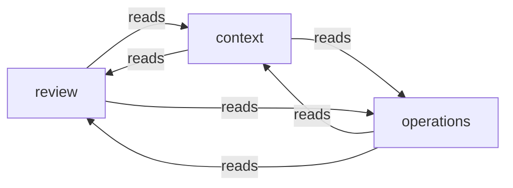

# Typology Architecture Brief

<!-- typology:generated -->

This document is a human-readable projection of the confirmed Typology catalog and the observed Go repository. The catalog remains the machine source of truth. This brief helps people inspect whether the design matches the code.

## How to read this brief

The **intended architecture** comes from the catalog. The **observed topology** comes from the Go import graph. Findings name evidence that needs an agent or architect to fix or record as boundary debt. Typology does not infer a final design decision from a finding.

## Intended architecture

### Bounded-context map

### Bounded contexts

| Slice | Objective | Route |
|-------|-----------|-------|
| `review` | Automate pull request review from staged changes through published findings. |  |
| `context` | Maintain durable repository context for consistent review jobs. |  |
| `operations` | Run the control plane and connect review workflows to external systems. |  |

### Context details

#### `review`

Automate pull request review from staged changes through published findings.

- Packages: ./internal/staging, ./internal/cluster, ./internal/diff, ./internal/sa, ./internal/satools, ./internal/orchestrate, ./internal/filereview, ./internal/reviewrun, ./internal/judge, ./internal/judge/evaluation/digest, ./internal/judge/evaluation/summary, ./internal/judge/evaluation/tech, ./internal/judge/modules, ./internal/agent, ./internal/workspace, ./internal/workspace/opencode, ./internal/report, ./internal/cache, ./internal/publish, ./internal/status
- Surfaces: 
- Programs: 

#### `context`

Maintain durable repository context for consistent review jobs.

- Packages: ./internal/contextstore, ./internal/contextdigest, ./internal/contextgate, ./internal/agenting
- Surfaces: 
- Programs: 

#### `operations`

Run the control plane and connect review workflows to external systems.

- Packages: ./internal/poll, ./internal/outbound, ./internal/githttps, ./internal/config, ./internal/aigateway, ./internal/observability, ./internal/submodule, ./internal/cli, ./cmd/majordomo
- Surfaces: operations-cli (cli)
- Programs: 

### Declared coupling

| From | To | Kind |
|------|----|------|
| `context` | `operations` | reads |
| `context` | `review` | reads |
| `operations` | `context` | reads |
| `operations` | `review` | reads |
| `review` | `context` | reads |
| `review` | `operations` | reads |

No component bindings are declared.

## Observed topology

The repository contains **33 Go packages** in the inspected modules:
- `.`

### High-coupling packages

| Package | In-degree | Out-degree |
|---------|-----------|------------|
| `./cmd/majordomo` | 0 | 4 |
| `./internal/agenting` | 3 | 0 |
| `./internal/aigateway` | 4 | 0 |
| `./internal/cache` | 3 | 1 |
| `./internal/cli` | 1 | 18 |
| `./internal/config` | 7 | 0 |
| `./internal/contextdigest` | 1 | 9 |
| `./internal/githttps` | 3 | 0 |
| `./internal/judge` | 3 | 7 |
| `./internal/observability` | 5 | 0 |
| `./internal/orchestrate` | 2 | 6 |
| `./internal/outbound` | 3 | 1 |
| `./internal/publish` | 3 | 2 |
| `./internal/reviewrun` | 1 | 7 |
| `./internal/staging` | 4 | 2 |

### Leaf packages

Leaf packages have no outgoing local imports. They may be valid infrastructure leaves or packages that should sit inside their only caller.

| Package | Imported by |
|---------|-------------|
| `./internal/agenting` | 3 |
| `./internal/aigateway` | 4 |
| `./internal/cluster` | 1 |
| `./internal/config` | 7 |
| `./internal/contextgate` | 2 |
| `./internal/diff` | 1 |
| `./internal/filereview` | 2 |
| `./internal/githttps` | 3 |
| `./internal/judge/evaluation/digest` | 1 |
| `./internal/judge/evaluation/summary` | 1 |
| `./internal/judge/evaluation/tech` | 1 |
| `./internal/judge/modules` | 2 |
| `./internal/observability` | 5 |
| `./internal/report` | 2 |
| `./internal/satools` | 1 |
| `./internal/status` | 1 |
| `./internal/submodule` | 1 |
| `./internal/workspace` | 1 |

### Shared platform leaves

./internal/config

### Merge candidates

These are heuristics for review, not automatic moves.

- `./internal/cli` may sit with `./cmd/majordomo`: sole importer: only imported by ./cmd/majordomo
- `./internal/cluster` may sit with `./internal/staging`: sole importer: only imported by ./internal/staging
- `./internal/contextdigest` may sit with `./internal/cli`: sole importer: only imported by ./internal/cli
- `./internal/diff` may sit with `./internal/cli`: sole importer: only imported by ./internal/cli
- `./internal/judge/evaluation/digest` may sit with `./internal/judge`: sole importer: only imported by ./internal/judge
- `./internal/judge/evaluation/summary` may sit with `./internal/judge`: sole importer: only imported by ./internal/judge
- `./internal/judge/evaluation/tech` may sit with `./internal/judge`: sole importer: only imported by ./internal/judge
- `./internal/poll` may sit with `./internal/cli`: sole importer: only imported by ./internal/cli
- `./internal/reviewrun` may sit with `./internal/cli`: sole importer: only imported by ./internal/cli
- `./internal/satools` may sit with `./internal/cli`: sole importer: only imported by ./internal/cli
- `./internal/status` may sit with `./internal/cli`: sole importer: only imported by ./internal/cli
- `./internal/submodule` may sit with `./internal/cli`: sole importer: only imported by ./internal/cli
- `./internal/workspace` may sit with `./internal/workspace/opencode`: sole importer: only imported by ./internal/workspace/opencode

### Similar package stems

- `agen`: ./internal/agent, ./internal/agenting. packages share stem "agen" but have different importers; verify if distinct bounded contexts before merging

## Drift and design questions

No catalog, path, import, or documentation findings were reported.

## Agent review protocol

1. Read the relevant catalog rows and the evidence named by each finding.
2. Fix the code or catalog when the boundary is wrong.
3. Record a temporary boundary decision in the Typology journey when the design needs a later refactor.
4. Re-run `typology architecture REPO` and `typology validate REPO`.
5. Remove the generated marker only after a human accepts the narrative as a reviewed explanation.
